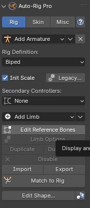

# VRoidStudioで出力したVRM1.0形式モデルのボーンをBlenderのRig(AutoRigPro/Rigify)に置き換えるアドオン

- [VRoidStudio](https://vroid.com/studio)
- [AutoRigPro](https://blendermarket.com/products/auto-rig-pro)
- Rigify(※Blender標準アドオン)

VRoidStudioで作ったVRM1.0形式のボーンをBlenderのArmatureで置き換えるアドオンです。置き換え先としてAutoRigProやRigifyが使えるので、いちいち自分でリグを組む必要が無くなります。

メインキャラ用途ではちょっと厳しいVRoidStudioですが、モブを出すにはわりと便利なのではないかと思います。しかしVRoidStudioで作ったモデルを使おうとするとリグの設定で結構手間がかかってしまい、むしろBlenderで素体から作成する方がトータルでは楽だったりします。

逆に言うとリグやウェイトがそのまま使えればだいぶ楽ができるので、Blenderでデファクトスタンダードと言えるAutoRigProやRigifyに簡単に置き換えられるようにしてみました。

ボーンとスキンウェイトの処理が分かれていますのでリグをカスタマイズした後でもボーンに大きな変更が無ければ(身長や手足胴の長さに大きな変更がない)、VRoidStudioで修正したモデルをBlenderでImportし直してスキンウェイトだけ再設定することができ、イテレーションしやすくなっています。

## 共通の準備

VRoidStudioでVRM1.0でExportしてください。VRM0.0ではボーンのRollがリセットされてしまって値を取得することができません。

こちらのアドオンを使ってBlenderでVRM1.0のモデルをImportしてください。

https://vrm-addon-for-blender.info/ja/

生成しようとしている物と同名のArmatureがすでにある場合は生成されるボーン名が変わってしまうので失敗します(現在ボーン名決め打ちで対応しています。ARPは名前変更に対応できそうだけどRigify対応はちょっとメンドクサそう……)

削除したてだと非表示ながらデータ内に古いArmatureがまだ存在している状態なので、完全に削除するためにBlenderの再起動(Revertでもよい)が必要になります。

## AutoRigProでの使い方

AutoRigProはリファレンスボーンを修正した後MatchToRigボタンでリグを生成し、そのリグのDeformボーンでスキンウェイトを設定する方式です。

### ARPのリファレンスボーンを設定する

1. AutoRigProのAddArmatureでHumanArmatureを生成 

1. AutoRigProでEditReferenceBonesボタンを押してリファレンスボーンの編集モードに 

1. ArmatureSwitcherのパネルのArmatureの所を設定 

1. ArmatureSwitcherのPresetの選択でAutoRigPro(ReferenceBone)を選択 

1. ArmatureSwitcherのMatchBonesボタンを押す 
<b>※PostProcessがVRoidToARPになっていること</b> 

1. AutoRigProのMatchToRigボタンを押す 

ここまででリグが作成されます。

### モデルのArmatureをARPのRigに置き換える

1. ArmatureSwitcherのパネルのArmatureの所を設定 

1. ArmatureSwitcherのPresetの選択でAutoRigPro(VertexGroup)を選択 

1. 置き換えたいモデルのオブジェクトを選択する 

1. ArmatureSwitcherのRemapVertexGroup&Armatureボタンを押す 

モディファイアのArmatureがRigに置き換わり、各頂点ウェイトのターゲットボーン名がAutoRigProのものに変更されます。

<b>髪の毛などはAutoRigProに対応するボーンが無いため頂点ウェイトが設定されません。VRMからボーンを移植するかhead.x等に頂点グループを手動で設定してください。</b>

### 後片付け

元のArmatureは不要なので削除して大丈夫です。子にメッシュがぶら下がっているのでメッシュごと削除しないように気をつけてください。

Collidersコレクションも丸っと不要なので削除して大丈夫です。

## Rigifyでの使い方

Rigifyはmetarig(リファレンスボーン)を修正した後GenerateRigボタンでリグを生成し、そのリグのDeformボーンでスキンウェイトを設定する方式です。

### ARPのmetarigを設定する

1. AddメニューのArmatureよりHuman(Meta-Rig)を追加する 
※メニューに出てこない場合はRigifyが有効になっていないかも 

1. ArmatureSwitcherのパネルのArmatureの所を設定 

1. ArmatureSwitcherのPresetの選択でRigify(Metarig)を選択 

1. ArmatureSwitcherのMatchBonesボタンを押す 
<b>※PostProcessがVRoidToRigifyになっていること</b> 

1. ObjectDataPropertyのRigifyにあるGenerateRigボタンを押す 

ここまででリグが作成されます。

### モデルのArmatureをRigifyのRigに置き換える

1. ArmatureSwitcherのパネルのArmatureの所を設定 
<b>※metarigではなくGenerateRigで生成されたリグです</b> 

1. ArmatureSwitcherのPresetの選択でRigify(VertexGroup)を選択 

1. 置き換えたいモデルのオブジェクトを選択する 

1. ArmatureSwitcherのRemapVertexGroup&Armatureボタンを押す 

モディファイアのArmatureがRigに置き換わり、各頂点ウェイトのターゲットボーン名がRigifyのものに変更されます。

<b>髪の毛などはRigifyに対応するボーンが無いため頂点ウェイトが設定されません。VRMからボーンを移植するかhead.x等に頂点グループを手動で設定してください。</b>

### 後片付け

元のArmatureは不要なので削除して大丈夫です。子にメッシュがぶら下がっているのでメッシュごと削除しないように気をつけてください。

metarigもGenerateRigした後ならいつでも削除できます。

WGTS_rigコレクション(GenerateRigの時に作られた中間データ)も丸っと不要なので削除して大丈夫です。